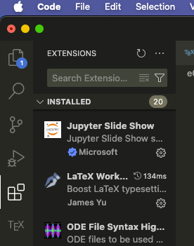
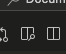

# How to download LaTeX onto your computer, Scotty's version. 

I like to use [VSCode](https://code.visualstudio.com/download) to do my LaTeX, so I'll give a rundown here. 

1. Download [VSCode](https://code.visualstudio.com/download) from this site and run the install process. 
2. Within VSCode, go to  this spot and download the plugin LaTeX Workshop by James Yu. This allows LaTeX to work better on your computer. 
3. Downloading a LaTeX distribution onto your computer so things compile. Visit [this site](https://www.latex-project.org/get/) to see which version of LaTeX distribution you need. I use Mac, so I need MacTeX. I've used Windows before, so I needed to get MikTex (or TexLive). I've used Linux and needed to use something like TeXLive. These are all linked with the link on this bullet point. 
4. Once you have this all downloaded and installed, let's start making a document. In your computer download the file [fast.tex](fast.tex) and open it in VSCode on your computer. Open the plugin on the sidebar labeled "TEX" and run "latexmk." If everything was installed properly, this should make a pdf document, which  you can view by clicking this button:  near the top of your screen. 
5. Now, make whatever LaTeX file you'd like!

If you run into any issues, feel free to reach out to me, Scotty, on the Zulip!